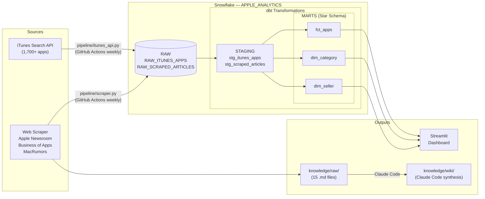
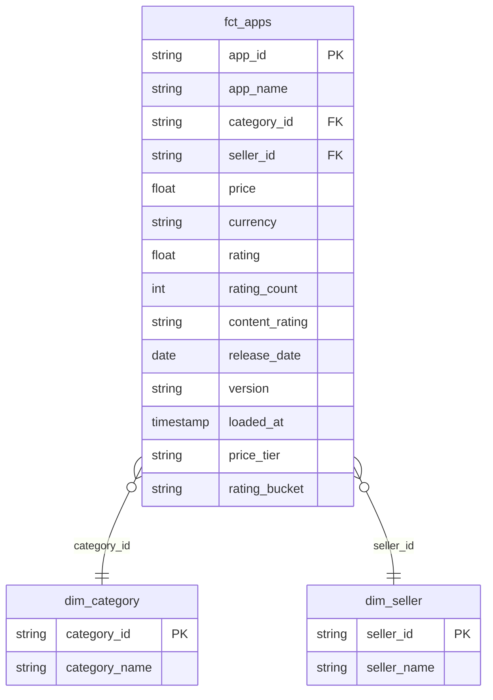

# Apple Subscription App Analytics Pipeline

This project analyzes the subscription app ecosystem on Apple's App Store using data from the iTunes Search API and scraped industry reports. It ingests 1,700+ apps across 25 categories into Snowflake, transforms them into a star schema via dbt, and surfaces insights through a live Streamlit dashboard and a Claude Code-curated knowledge base — demonstrating end-to-end data engineering skills aligned with Apple's Subscription Analytics team.

## Job Posting

- **Role:** Data Scientist, Subscription Analytics
- **Company:** Apple
- **Link:** See `docs/job-posting.pdf`

This project demonstrates the full analytical stack the role requires: pipeline engineering (API + scraper ingestion), warehouse modeling (Snowflake + dbt star schema), dashboard delivery (Streamlit), and subscription market research (knowledge base with 15+ curated sources).

## Tech Stack

| Layer | Tool |
|---|---|
| Source 1 | iTunes Search API (REST, no auth) |
| Source 2 | Web scrape — Apple Newsroom, Business of Apps, MacRumors |
| Data Warehouse | Snowflake (AWS US West 2) |
| Transformation | dbt (staging views + mart tables) |
| Orchestration | GitHub Actions (weekly scheduled + manual trigger) |
| Dashboard | Streamlit (deployed to Streamlit Community Cloud) |
| Knowledge Base | Claude Code (scrape → summarize → query) |

## Pipeline Diagram

## ERD (Star Schema)

## Dashboard Preview

<!-- Add a screenshot: drag an image here or use  -->

**Live URL:** https://apple-job-application-etjahl3bwgw9zkrnpqomyg.streamlit.app/

## Key Insights

**Descriptive — Free apps dominate but paid apps earn higher ratings:** ~85% of App Store apps are free, yet paid apps average significantly higher user ratings. The distribution is skewed: top-rated categories (Productivity, Finance) are dominated by paid or freemium models, while Entertainment and Games trend free.

**Diagnostic — Paid users are higher-signal raters:** Users who pay for an app are more invested and less likely to leave low-effort negative reviews. Developers who charge premium prices also tend to invest more in quality and support, compounding the rating advantage.

**Recommendation:** Subscription app developers entering competitive categories should achieve a 4.0+ rating baseline before monetizing — rating is the strongest leading indicator of organic discovery and conversion on the App Store.

## Live Dashboard

**URL:** https://apple-job-application-etjahl3bwgw9zkrnpqomyg.streamlit.app/

## Knowledge Base

A Claude Code-curated wiki built from 15 scraped sources across Apple Newsroom, Business of Apps, and MacRumors. Wiki pages live in `knowledge/wiki/`, raw sources in `knowledge/raw/`. Browse `knowledge/index.md` to see all pages.

**Query it:** Open Claude Code in this repo and ask questions like:

- "What does my knowledge base say about Apple subscription growth trends?"
- "Summarize the competitive landscape between Apple Music and Spotify."
- "What KPIs should a subscription analytics team track?"

Claude Code reads the wiki pages first and falls back to raw sources when needed. See `CLAUDE.md` for the query conventions.

## Setup & Reproduction

**Requirements:** Python 3.12, Snowflake account, GitHub repository with Actions enabled.

Copy `.env.example` to `.env` and fill in your credentials:

    SNOWFLAKE_ACCOUNT=
    SNOWFLAKE_USER=
    SNOWFLAKE_PASSWORD=
    SNOWFLAKE_DATABASE=
    SNOWFLAKE_SCHEMA=
    SNOWFLAKE_WAREHOUSE=

**Run ingestion locally:**

    pip install requests beautifulsoup4 snowflake-connector-python python-dotenv
    python pipeline/itunes_api.py
    python pipeline/scraper.py

**Run dbt transformations:**

    cd dbt
    dbt run

**Run dashboard locally:**

    pip install streamlit snowflake-connector-python pandas plotly
    streamlit run dashboard/app.py

**GitHub Actions** run both pipelines automatically every Monday. Trigger manually via Actions → Run workflow.

## Repository Structure

    .
    ├── .github/workflows/       # GitHub Actions (iTunes API + scraper pipelines)
    ├── pipeline/                # Python ingestion scripts
    │   ├── itunes_api.py        # Source 1: iTunes Search API → Snowflake RAW
    │   └── scraper.py           # Source 2: web scrape → Snowflake RAW + knowledge/raw/
    ├── dbt/                     # dbt project (staging views + star schema marts)
    │   └── models/
    │       ├── staging/         # stg_itunes_apps, stg_scraped_articles
    │       └── marts/           # fct_apps, dim_category, dim_seller
    ├── dashboard/               # Streamlit app
    ├── knowledge/               # Knowledge base
    │   ├── raw/                 # 15 scraped source documents
    │   ├── wiki/                # Claude Code-synthesized wiki pages
    │   └── index.md             # Index of all knowledge base content
    ├── docs/                    # Proposal, job posting PDF, slides
    ├── .env.example             # Required environment variables
    ├── .gitignore
    ├── CLAUDE.md                # Project context for Claude Code
    └── README.md                # This file
